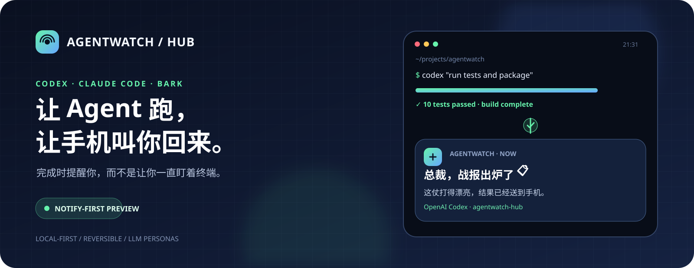
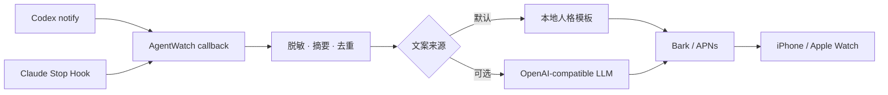

<p align="center">
  
</p>

<p align="center">
  <a href="https://www.python.org/"></a>
  <a href="https://github.com/Finb/Bark"></a>
  <a href="https://github.com/MMX-boop/agentwatch-hub/actions/workflows/ci.yml"></a>
  <a href="LICENSE"></a>
</p>

<p align="center">
  <strong>Codex / Claude Code 跑完以后，让 iPhone 和 Apple Watch 主动叫你回来。</strong>
  <br />
  <sub>完成通知 · LLM 动态人格 · 本地优先 · 可逆安装</sub>
</p>

<p align="center">
  <a href="#quick-start">三分钟安装</a> ·
  <a href="#personas">通知人格</a> ·
  <a href="#privacy">隐私边界</a> ·
  <a href="#roadmap">路线图</a>
</p>

---

## 为什么做 AgentWatch？

让 Coding Agent 跑一个十几分钟的任务时，最烦的不是等，而是**不知道什么时候等完**。

盯着终端浪费时间，离开电脑又会忍不住回来刷新。AgentWatch 目前只解决这一件小事：监听 Codex CLI 和 Claude Code 的真实完成事件，任务结束后通过 Bark 把结果送到 iPhone 和 Apple Watch。

```text
总裁，战报出炉了 📋
这仗打得漂亮，细节已经备好，就等您签字。

Agent：OpenAI Codex
项目：agentwatch-hub
结果：测试和构建均已通过。
```

> [!NOTE]
> 当前是 **Notify-first Preview**。公开版本专注通知，没有网页服务、数据库或手机远程控制。电脑和手机能够联网即可，不要求处于同一个 Wi-Fi。

## 实机效果

<table>
  <tr>
    <td align="center" width="50%">
      
    </td>
    <td align="center" width="50%">
      
    </td>
  </tr>
  <tr>
    <td align="center"><strong>抬腕就知道任务结束</strong><br /><sub>Apple Watch · Bark</sub></td>
    <td align="center"><strong>Codex 与 Claude Code 统一收件箱</strong><br /><sub>iPhone · Bark 历史消息</sub></td>
  </tr>
</table>

<p align="center"><sub>图片为早期完整开发环境的实机联调记录；当前公开版不附带 localhost 链接，也不会在完成后追加 idle_prompt 等待提醒。</sub></p>

## 一眼看懂

| | |
| --- | --- |
| **🛰️ 双 Agent 接入**<br />Codex 使用官方 `notify`；Claude Code 使用 `Stop / StopFailure` Hooks。 | **⌚ 触腕提醒**<br />Bark 通知同时抵达 iPhone 和 Apple Watch，不用守着终端。 |
| **🎭 12 种通知人格**<br />总裁、皇上、甄嬛、猫主子、侦探……同一结果可以换种方式报信。 | **✨ LLM 临场发挥**<br />人格标题和短评按任务结果动态生成，失败时自动回退到本地模板。 |
| **🧹 摘要与去重**<br />长回复压缩成一句话；同一完成事件不会连续轰炸手机。 | **🔐 本地与可逆**<br />配置只保存在本机，安装前备份，卸载时恢复原有设置。 |

## 它和普通 Bark 脚本有什么不同？



AgentWatch 不抓取终端窗口，也不靠“进程是不是还活着”猜任务状态。它接入 Agent 自己提供的完成边界：

- Codex 回调收到 `agent-turn-complete` JSON。
- Claude Code Hook 收到 `Stop` 或 `StopFailure` JSON。
- 每次完成时回调进程短暂启动，通知发送后退出。
- 失败不会阻止 Agent 结束当前任务。

Codex 的 `notify` 配置说明见 [OpenAI 官方配置参考](https://developers.openai.com/codex/config-reference)。

<a id="quick-start"></a>

## 三分钟安装

需要 Python 3.11+、Bark，以及已经可以正常运行的 Codex CLI 或 Claude Code。

### 1 · 安装

```bash
git clone https://github.com/MMX-boop/agentwatch-hub.git
cd agentwatch-hub
python -m venv .venv
```

<details open>
<summary><strong>Windows PowerShell</strong></summary>

```powershell
.\.venv\Scripts\Activate.ps1
python -m pip install -e .
```

</details>

<details>
<summary><strong>macOS / Linux</strong></summary>

```bash
source .venv/bin/activate
python -m pip install -e .
```

</details>

### 2 · 填写 Bark Key

```bash
agentwatch-notify init
```

打开 `~/.agentwatch-notify/.env`：

```dotenv
BARK_DEVICE_KEY=你的设备Key
PERSONA=boss
```

### 3 · 安装回调

```bash
agentwatch-notify install all
```

重启 Codex / Claude Code，然后检查状态：

```bash
agentwatch-notify doctor
```

最后主动发送一次测试：

```bash
agentwatch-notify test
```

只安装一个 Agent 也可以：

```bash
agentwatch-notify install codex
agentwatch-notify install claude
```

<a id="personas"></a>

## 不是“任务已完成”，是角色本人来报信

内置模板开箱即用；配置 OpenAI-compatible LLM 后，每条通知会根据本次结果现场生成。LLM 只负责人格标题与一句短评，Agent、项目和结果由程序追加，避免技术事实被改写。

| 人格 | 配置值 | 可能的报信方式 |
| --- | --- | --- |
| 总裁版 | `boss` | **总裁，战报出炉了** —— 这仗打得漂亮，细节已经备好。 |
| 少爷版 | `heir_male` | **少爷，这局稳稳落地** —— 麻烦事收拾好了，您慢慢回来。 |
| 大小姐版 | `heir_female` | **大小姐，结果漂亮收尾** —— 这一页已经整理得很体面。 |
| 皇上版 | `emperor` | **启禀皇上，差事已成** —— 折子已呈上，今日可以退朝了。 |
| 甄嬛版 | `palace` | **娘娘，这桩事成了** —— 风声已定，结果也送到了手边。 |
| 管家版 | `butler` | **主人，结果已上银盘** —— 回来时正好验收。 |
| 军师版 | `strategist` | **主公，此役已定** —— 棋子已经落稳。 |
| 损友版 | `bestie` | **搭子，这活拿下了** —— 它没跑掉，已经老实躺在结果页。 |
| 猫主子版 | `cat` | **铲屎官，战利品叼回来了** —— 巡逻结束，结果放门口了，喵。 |
| 赛博版 | `cyber` | **指挥官，任务协议闭环** —— 结果信号已经抵达。 |
| 侦探版 | `detective` | **探长，可以结案了** —— 线索对齐，谜底就在结果页。 |
| 标准版 | `off` | 简洁、自然、不使用角色称呼。 |

分别给两个 Agent 设置人格：

```dotenv
PERSONA=boss
CLAUDE_PERSONA=palace
CODEX_PERSONA=cyber
```

### 开启 LLM 动态文案

```dotenv
LLM_BASE_URL=https://your-provider.example/v1
LLM_API_KEY=your-api-key
LLM_MODEL=your-model
```

先在终端预览，不发送 Bark：

```bash
agentwatch-notify preview \
  --provider claude \
  --result "修复登录问题，测试全部通过。"
```

接口超时、返回格式异常或没有配置 LLM 时，会自动使用本地人格模板。

<a id="privacy"></a>

## 数据去了哪里？

| 数据 | 本机 | Bark | 可选 LLM |
| --- | :---: | :---: | :---: |
| Bark Device Key | ✅ | 请求体 | ❌ |
| LLM API Key | ✅ | ❌ | 请求头 |
| Agent 名称 | ✅ | ✅ | ✅ |
| 项目文件夹名 | ✅ | ✅ | ✅ |
| 脱敏限长摘要 | ✅ | ✅ | ✅ |
| 完整对话与代码 | ❌ | ❌ | ❌ |
| 项目绝对路径 | ❌ | ❌ | ❌ |
| 工具参数 / 环境变量 | ❌ | ❌ | ❌ |

> [!IMPORTANT]
> 默认不使用 LLM。只有同时填写 `LLM_BASE_URL` 和 `LLM_MODEL` 后，脱敏字段才会发送到你选择的服务。

- `.env` 已被 Git 忽略。
- Bark Key 放在 HTTPS POST 请求体中，不出现在 URL 或通知正文。
- 结果先清理 Markdown，再执行常见 Token、API Key、Authorization 与私钥脱敏。
- Claude 的其他 Hooks 会保留；Codex 原有 `notify` 命令会继续执行。
- 安装器修改配置前创建带时间戳的备份。

通用脱敏规则无法证明能识别所有未标注的自定义秘密。请避免让 Agent 在最终回复中直接输出密码或私钥。

## 配置与命令

<details>
<summary><strong>完整 Bark 配置</strong></summary>

```dotenv
NOTIFY_ENABLED=true
BARK_SERVER=https://api.day.app
BARK_DEVICE_KEY=
BARK_GROUP=AgentWatch
BARK_SOUND=minuet
BARK_LEVEL=active
BARK_ICON_URL=https://example.com/icon.png

# 可选 HTTP(S) 代理
OUTBOUND_PROXY=http://127.0.0.1:7890
```

- 自建 Bark 服务必须使用 HTTPS。
- 图标地址需要能被手机直接访问。
- Bark 可能缓存相同 URL，更换图标时建议换文件名。

</details>

<details>
<summary><strong>命令速查</strong></summary>

| 命令 | 作用 |
| --- | --- |
| `agentwatch-notify init` | 创建本地配置 |
| `agentwatch-notify install all` | 安装两种 Agent 回调 |
| `agentwatch-notify doctor` | 检查配置，不发通知 |
| `agentwatch-notify test` | 明确发送一条 Bark 测试 |
| `agentwatch-notify preview` | 预览人格文案，不发 Bark |
| `agentwatch-notify personas` | 列出人格配置值 |
| `agentwatch-notify uninstall all` | 移除回调并恢复旧配置 |

</details>

<details>
<summary><strong>什么时候需要重装回调？</strong></summary>

人格、LLM、铃声等设置每次通知时都会重新读取，保存 `.env` 后无需重装。

以下情况需要重新运行 `agentwatch-notify install all`：

- 移动了项目目录。
- 重建或更换了 Python 虚拟环境。
- 修改了 `CODEX_HOME` 或 `CLAUDE_CONFIG_DIR`。

第一次安装回调后，需要重启对应的 Agent CLI。

</details>

## 卸载不会留下钩子

```bash
agentwatch-notify uninstall all
```

它只移除 AgentWatch 自己的 Claude Hook，并把 Codex `notify` 恢复到安装前的值。本地 `.env` 和项目目录不会被删除。

<a id="roadmap"></a>

## 路线图

当前版本专注“任务结束后通知我”。项目还在持续打磨，接下来准备：

- [ ] 完善 Windows、Linux 与 macOS 的真实 CLI 兼容测试
- [ ] PyPI 一键安装和自动升级
- [ ] 接入 Gemini CLI、OpenCode、Aider 等 Coding Agent
- [ ] 支持 ntfy、Gotify、Telegram、飞书等通知渠道
- [ ] 自定义人格、提示词与每个 Agent 的独立规则
- [ ] 本地 Web Dashboard、任务历史和运行状态
- [ ] 带一次性授权、审计记录与安全边界的手机批阅

仓库叫 **AgentWatch Hub**，因为通知只是第一块拼图。Dashboard 和远程批阅会在真实链路和安全边界验证完成后再开放。

## Troubleshooting

<details>
<summary><strong>Bark 测试成功，但任务结束没有通知</strong></summary>

1. 运行 `agentwatch-notify doctor`。
2. 重启 Codex CLI / Claude Code。
3. 重新执行 `agentwatch-notify install codex` 或 `install claude`。
4. 如果移动过仓库或 `.venv`，必须重新安装回调。

</details>

<details>
<summary><strong>Windows 中文出现乱码</strong></summary>

当前版本会从 Hook 标准输入读取原始字节并按 UTF-8 解码。如果仍有乱码，请提交系统、Python 与 Claude Code 版本以及脱敏后的最小复现。

</details>

<details>
<summary><strong>为什么收到重复通知？</strong></summary>

Codex 按 thread-id / turn-id 去重一天；Claude 按 session、事件和结果摘要做短窗口去重。新的真实回合仍会正常提醒。

</details>

## 开发

```bash
python -m pip install -e ".[dev]"
pytest -q
ruff check .
```

CI 覆盖 Windows / Ubuntu 与 Python 3.11 / 3.12。测试使用 fixture 和 MockTransport，不连接真实 LLM、Bark、Codex 或 Claude Code。

## 参与项目

目前最需要的是不同系统、不同 Agent 版本的真实反馈。提交 Issue 时请附上操作系统、Python 版本和 Agent 版本，并先删除用户名、项目路径与密钥。

如果 AgentWatch 让你少盯了一会儿终端，欢迎点个 Star。

## 🔗 友情链接

本项目在开发和分享过程中得到了社区交流与反馈，感谢：

- [LINUX DO - 新的理想型社区](https://linux.do/)

<p align="center">
  <a href="https://github.com/MMX-boop/agentwatch-hub/issues">提交问题</a> ·
  <a href="https://github.com/MMX-boop/agentwatch-hub">项目主页</a> ·
  <a href="LICENSE">MIT License</a>
</p>
