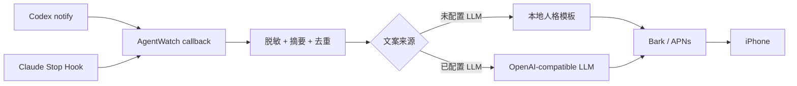

<div align="center">

# AgentWatch Hub

**Codex / Claude Code 跑完以后，让 iPhone 主动叫你回来。**

[](https://www.python.org/)
[](https://github.com/Finb/Bark)
[](https://github.com/MMX-boop/agentwatch-hub/actions/workflows/ci.yml)
[](LICENSE)

完成通知 · LLM 动态人格 · 本地优先 · 可逆安装

</div>

---

让 Coding Agent 跑一个十几分钟的任务时，你大概率不会一直盯着终端。

AgentWatch 目前只解决这一件小事：**监听 Codex CLI 和 Claude Code 的完成事件，在任务结束后通过 Bark 给 iPhone 发一条通知。** 电脑和手机能上网即可，不要求在同一个 Wi-Fi，也不需要把开发机暴露到公网。

```text
总裁，战场已净 📋
这局收得漂亮，战报已经放上桌。
Agent：Claude Code
项目：my-project
结果：测试和构建均已通过。
```

人格文案可以使用本地模板，也可以交给你自己的 OpenAI-compatible LLM 临场生成。同一个结果，切换成皇上版、甄嬛版、猫主子版或侦探版，会收到完全不同的报信方式。

> 当前是 **Notify-first Preview**：仓库只发布通知核心。网页 Dashboard、手机批阅和远程控制仍在路线图中，不属于当前版本。

## 已经能做什么

- **Codex CLI 完成通知**：使用官方 `notify` 配置接收 `agent-turn-complete` JSON。
- **Claude Code 完成通知**：安装 `Stop` / `StopFailure` Hooks，不修改 Claude 的权限模式。
- **Bark 推送**：支持官方 Bark 服务、自建 HTTPS Bark 服务、铃声、级别和自定义图标。
- **12 种通知风格**：标准、总裁、少爷、大小姐、皇上、甄嬛、管家、军师、损友、猫主子、赛博和侦探。
- **LLM 动态文案**：结合本次结果生成一句有角色感的短评，失败时自动回退到本地模板。
- **结果压缩**：长篇 Agent 回复会压成一条适合通知栏阅读的摘要，去掉 Markdown 噪音。
- **去重**：Codex 依据 thread / turn 去重；Claude 的重复 Stop 在短窗口内只推送一次。
- **UTF-8 中文链路**：Hook 从原始字节按 UTF-8 解码，避免 Windows 上出现“娴嬭瘯…”乱码。
- **可逆安装**：保留已有 Claude Hooks；Codex 原有 `notify` 命令会被记录、串联并在卸载时恢复。

## 工作方式



它没有常驻 Web 服务、数据库或网页前端。每次 Coding Agent 完成一轮工作时，回调进程短暂启动，发送通知后退出。

## 三分钟安装

需要：

- Python 3.11+
- 已安装并能正常使用的 Codex CLI 或 Claude Code
- iPhone 上的 [Bark](https://github.com/Finb/Bark)

### 1. 安装 AgentWatch

```bash
git clone https://github.com/MMX-boop/agentwatch-hub.git
cd agentwatch-hub
python -m venv .venv
```

Windows PowerShell：

```powershell
.\.venv\Scripts\Activate.ps1
python -m pip install -e .
```

macOS / Linux：

```bash
source .venv/bin/activate
python -m pip install -e .
```

### 2. 创建本地配置

```bash
agentwatch-notify init
```

配置文件会创建在：

```text
~/.agentwatch-notify/.env
```

打开 Bark，在“服务器”页面复制设备 Key，然后填入：

```dotenv
BARK_DEVICE_KEY=你的设备Key
PERSONA=boss
```

`.env` 只保存在你的电脑上，已被 Git 忽略。

### 3. 安装回调

同时安装 Codex 和 Claude Code：

```bash
agentwatch-notify install all
```

也可以只装一个：

```bash
agentwatch-notify install codex
agentwatch-notify install claude
```

安装后重启对应的 CLI。检查配置不会发送通知：

```bash
agentwatch-notify doctor
```

确认无误后，主动发送一次测试通知：

```bash
agentwatch-notify test
```

之后照常使用 `codex` 或 `claude`。任务结束时，AgentWatch 会自行运行。

## 让 LLM 负责“报信语气”

不配置 LLM 时，AgentWatch 使用内置人格模板。要让每条通知都根据任务结果现场发挥，在 `.env` 增加一个 OpenAI-compatible Chat Completions 服务：

```dotenv
PERSONA=boss

LLM_BASE_URL=https://your-provider.example/v1
LLM_API_KEY=your-api-key
LLM_MODEL=your-model
```

先在终端预览，不推送 Bark：

```bash
agentwatch-notify preview --provider claude --result "修复登录问题，测试全部通过。"
```

LLM 只写两部分：**人格标题**和**一句角色短评**。`Agent / 项目 / 结果`由程序追加，避免模型把技术事实写错。

发送给 LLM 的字段只有：人格、事件类型、Agent 名称、项目文件夹名和一条脱敏限长摘要。不发送完整对话、代码、项目路径、工具参数、环境变量或 Bark Key。接口超时、返回格式不正确或没有配置 LLM 时，通知会自动使用本地模板。

## 通知人格

| 配置值 | 称呼 / 风格 | 示例意象 |
| --- | --- | --- |
| `off` | 标准工作助手 | 简洁、自然 |
| `boss` | 总裁版 | 战报、签字、项目桌 |
| `heir_male` | 少爷版 | 私人助理、轻松收尾 |
| `heir_female` | 大小姐版 | 精致、自信、宠溺式幽默 |
| `emperor` | 皇上版 | 折子、圣旨、退朝 |
| `palace` | 甄嬛版 | 原创宫廷机锋，不引用台词 |
| `butler` | 管家版 | 茶点、银盘、钟声 |
| `strategist` | 军师版 | 战局、落子、破局 |
| `bestie` | 损友版 | 轻微吐槽、搭子感 |
| `cat` | 猫主子版 | 巡逻、爪印、战利品 |
| `cyber` | 赛博版 | 舱门、协议、信号 |
| `detective` | 侦探版 | 线索、证物、结案 |

全局人格使用 `PERSONA`。也可以分别设置：

```dotenv
PERSONA=boss
CLAUDE_PERSONA=palace
CODEX_PERSONA=cyber
```

## Bark 选项

```dotenv
BARK_SERVER=https://api.day.app
BARK_GROUP=AgentWatch
BARK_SOUND=minuet
BARK_LEVEL=active
BARK_ICON_URL=https://example.com/icon.png
```

- 自建 Bark 服务必须使用 HTTPS。
- `BARK_ICON_URL` 必须是手机能够直接访问的图片地址。
- Bark 可能缓存相同的图标 URL；更换图片后可以修改 URL 查询版本或文件名。
- 网络需要代理时可设置 `OUTBOUND_PROXY=http://127.0.0.1:7890`。

## 常用命令

| 命令 | 作用 |
| --- | --- |
| `agentwatch-notify init` | 创建本地配置 |
| `agentwatch-notify install all` | 安装两种 Agent 回调 |
| `agentwatch-notify doctor` | 检查配置，不发通知 |
| `agentwatch-notify test` | 明确发送一条 Bark 测试 |
| `agentwatch-notify preview` | 本地预览人格文案，不发 Bark |
| `agentwatch-notify personas` | 列出人格配置值 |
| `agentwatch-notify uninstall all` | 移除回调并恢复旧配置 |

## 配置改了为什么没生效？

人格、LLM、Bark 铃声等选项每次通知时都会重新读取，保存 `.env` 后无需重装。以下情况需要重新安装或重启：

- 修改或移动了 Python 虚拟环境：重新运行 `agentwatch-notify install all`。
- 刚安装回调：重启 Codex CLI / Claude Code，让它们重新加载配置。
- 修改了 `CODEX_HOME` 或 `CLAUDE_CONFIG_DIR`：在新环境下重新执行安装。

## 安全与隐私

- Bark Device Key 和 LLM Key 只存放在 `~/.agentwatch-notify/.env`。
- 密钥放在 Bark POST 请求体中，不出现在请求 URL、通知正文或日志里。
- 结果摘要会先执行常见 token、API key、Authorization 和私钥脱敏，再限长。
- 默认不使用 LLM；只有填写 `LLM_BASE_URL` 和 `LLM_MODEL` 后才会发送脱敏字段。
- 安装器修改配置前会创建带时间戳的备份。
- Claude 的其他 Hooks 会保留；Codex 原有通知命令会继续被调用。
- 通知失败不会阻止 Codex 或 Claude Code 完成当前任务。

请仍然避免让 Agent 在最终回复中直接输出未标注的密码或私钥。通用脱敏规则无法证明能识别所有自定义秘密。

## 卸载

```bash
agentwatch-notify uninstall all
```

卸载只移除 AgentWatch 自己的 Claude Hook，并把 Codex 的 `notify` 恢复为安装前的值。项目目录和本地 `.env` 不会被删除。

## Troubleshooting

**Bark 没有通知**

1. 运行 `agentwatch-notify doctor`。
2. 确认 iOS 已允许 Bark 的通知、声音和横幅。
3. 运行 `agentwatch-notify test`；如果测试失败，先检查 Device Key、HTTPS 地址和代理。
4. 测试成功但任务结束没通知时，重新安装回调并重启对应 CLI。

**通知重复**

Codex 使用 thread-id / turn-id 去重一天；Claude 使用 session、事件和结果摘要做短窗口去重。一次新的真实回合仍会正常提醒。

**Windows 中文乱码**

当前版本从 Hook 标准输入读取原始字节并按 UTF-8 解码。若仍看到乱码，请提交 Claude Code 版本、Python 版本和最小复现，注意删除路径与密钥。

**移动项目后失效**

配置中保存的是安装时 Python 的绝对路径。移动仓库或重建 `.venv` 后，激活新环境并重新运行 `agentwatch-notify install all`。

## 当前边界与路线图

这个首发版专注通知，因此当前没有：

- 网页 Dashboard
- 手机远程审批或追加指令
- 远程终止 Agent
- 云端账户和多用户同步
- Android 原生推送 Provider

后续计划：

- [ ] Web Dashboard 和历史时间线
- [ ] 经安全边界约束的单次审批
- [ ] 更多推送 Provider
- [ ] 更多 Coding Agent 适配器
- [ ] PyPI 一键安装

仓库仍叫 **AgentWatch Hub**，因为通知只是第一块拼图；等控制台和安全审批成熟后，它会自然长成完整的本地 Coding Agent Hub。

## 开发

```bash
python -m pip install -e ".[dev]"
pytest -q
ruff check .
```

测试使用本地 fixture 和 MockTransport，不会连接真实 LLM、Bark、Codex 或 Claude Code。

Codex 的 `notify` 行为以 [OpenAI 官方配置参考](https://developers.openai.com/codex/config-reference) 为准；Claude Code 使用其官方 command Hooks 机制。

## License

[MIT](LICENSE)

如果这个小工具让你少盯了一会儿终端，欢迎点个 Star。遇到兼容问题，请带上操作系统、Python 版本和 Agent 版本提交 Issue，记得先删除用户名、项目路径与密钥。

## 🔗 友情链接

本项目在开发和分享过程中得到了社区交流与反馈，感谢：

- [LINUX DO - 新的理想型社区](https://linux.do/)
