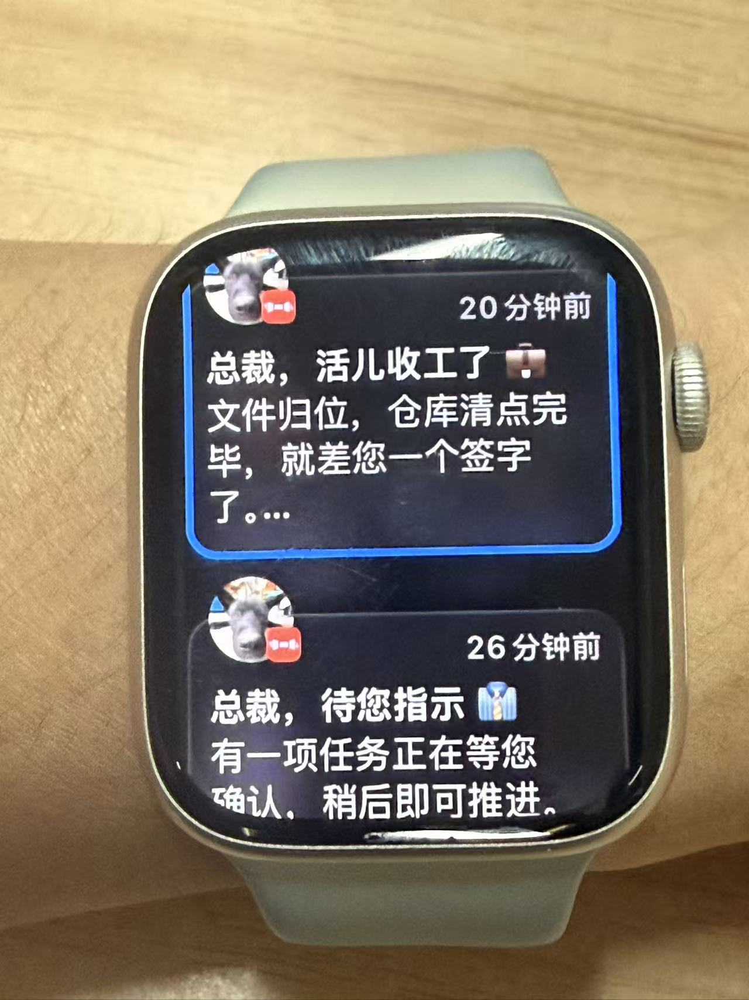
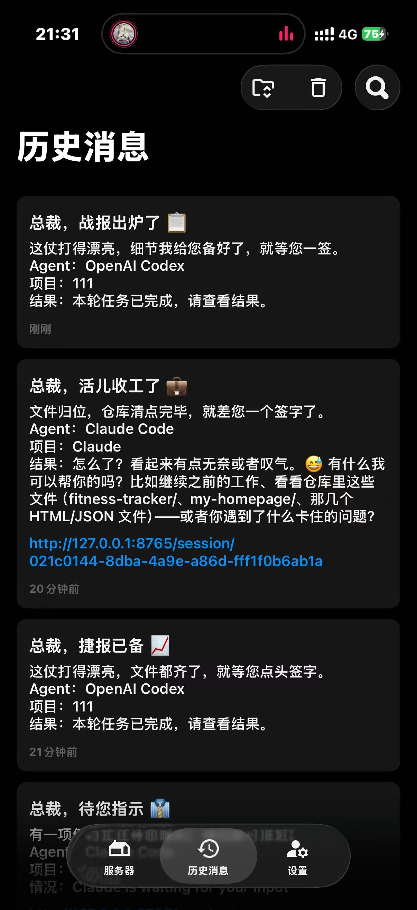
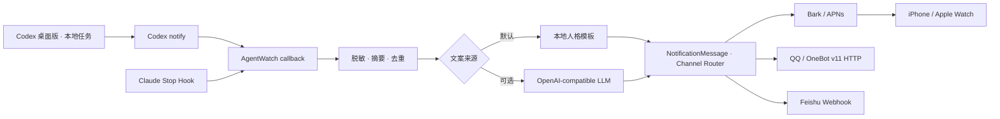

<p align="center">
  
</p>

<p align="center">
  <a href="https://www.python.org/"></a>
  <a href="https://github.com/Finb/Bark"></a>
  <a href="https://github.com/MMX-boop/agentwatch-hub/actions/workflows/ci.yml"></a>
  <a href="LICENSE"></a>
</p>

<p align="center">
  <strong>Codex 桌面版 / Claude Code 跑完以后，通过 Bark、QQ 或飞书叫你回来。</strong>
  <br />
  <sub>完成通知 · LLM 动态人格 · 本地优先 · 可逆安装</sub>
</p>

<p align="center">
  <a href="#quick-start">三分钟安装</a> ·
  <a href="#channels">通知通道</a> ·
  <a href="#personas">通知人格</a> ·
  <a href="#privacy">隐私边界</a> ·
  <a href="#roadmap">路线图</a>
</p>

---

## 为什么做 AgentWatch？

让 Coding Agent 跑一个十几分钟的任务时，最烦的不是等，而是**不知道什么时候等完**。

盯着任务窗口浪费时间，离开电脑又会忍不住回来查看。AgentWatch 接收 **Codex 桌面版的本地任务**和 **Claude Code CLI** 的完成事件，回合结束后把提醒送到 **Bark / QQ / 飞书**。可以任选一个，也可以同时发送。

**主要使用场景是 Codex 桌面应用 + Claude Code。** 安装过程需要运行几条终端命令；安装好后，你继续在 Codex 桌面应用里运行任务即可。Codex CLI 可以复用同一个 `notify` 配置。

```text
总裁，战报出炉了 📋
这仗打得漂亮，细节已经备好，就等您签字。

Agent：OpenAI Codex
项目：agentwatch-hub
结果：测试和构建均已通过。
```

> [!NOTE]
> **Current：完成通知。Next：IM → Agent 双向交互（仅设计，未实现）。** 当前没有消息接收服务、网页服务、数据库或远程执行能力。QQ 使用独立运行的 OneBot 服务；飞书使用群自定义机器人 Webhook。

## 实机效果

<table>
  <tr>
    <td align="center" width="50%">
      
    </td>
    <td align="center" width="50%">
      
    </td>
  </tr>
  <tr>
    <td align="center"><strong>抬腕就知道任务结束</strong><br /><sub>Apple Watch · Bark</sub></td>
    <td align="center"><strong>Codex 与 Claude Code 统一收件箱</strong><br /><sub>iPhone · Bark 历史消息</sub></td>
  </tr>
</table>

<p align="center"><sub>图片为早期完整开发环境的实机联调记录；当前公开版不附带 localhost 链接，也不会在完成后追加 idle_prompt 等待提醒。</sub></p>

## 一眼看懂

| | |
| --- | --- |
| **🛰️ 双 Agent 接入**<br />Codex 使用官方 `notify`；Claude Code 使用 `Stop / StopFailure` Hooks。 | **📨 多通道提醒**<br />Bark、QQ / OneBot、飞书 Webhook；任选或同时启用，失败相互隔离。 |
| **🎭 12 种通知人格**<br />总裁、皇上、甄嬛、猫主子、侦探……同一结果可以换种方式报信。 | **✨ LLM 临场发挥**<br />人格标题和短评按任务结果动态生成，失败时自动回退到本地模板。 |
| **🧹 摘要与去重**<br />长回复压缩成一句话；同一完成事件不会连续轰炸手机。 | **🔐 本地与可逆**<br />配置只保存在本机，安装前备份，卸载时恢复原有设置。 |

## 它和普通 Bark 脚本有什么不同？



AgentWatch 不抓取终端窗口，也不靠“进程是不是还活着”猜任务状态。它接入 Agent 自己提供的完成边界：

- Codex 回调收到 `agent-turn-complete` JSON。
- Claude Code Hook 收到 `Stop` 或 `StopFailure` JSON。
- 每次完成时回调进程短暂启动，通知发送后退出。
- 失败不会阻止 Agent 结束当前任务。

Codex 的 `notify` 配置说明见 [OpenAI 官方配置参考](https://developers.openai.com/codex/config-reference)。

<a id="quick-start"></a>

## 三分钟安装

需要 Python 3.11+、至少一个通知通道，以及已经可以正常运行的 **Codex 桌面版**或 **Claude Code CLI**。只使用 Codex 桌面版时，无需为了通知另行安装 Codex CLI。

### 1 · 安装

```bash
git clone https://github.com/MMX-boop/agentwatch-hub.git
cd agentwatch-hub
python -m venv .venv
```

<details open>
<summary><strong>Windows PowerShell</strong></summary>

```powershell
.\.venv\Scripts\Activate.ps1
python -m pip install -e .
```

</details>

<details>
<summary><strong>macOS / Linux</strong></summary>

```bash
source .venv/bin/activate
python -m pip install -e .
```

</details>

### 2 · 配置一个通知通道

```bash
agentwatch-notify init
```

打开 `~/.agentwatch-notify/.env`。Bark 用户只需填写以下内容；QQ / 飞书用户使用后面的[通道配置](#channels)，不需要 Bark Key：

```dotenv
BARK_DEVICE_KEY=你的设备Key
PERSONA=boss
```

### 3 · 安装回调

```bash
agentwatch-notify install all
```

安装完成后，完全退出并重新打开 **Codex 桌面应用**；如果也安装了 Claude Code 回调，请重新启动对应的 Claude Code 会话。然后检查配置：

```bash
agentwatch-notify doctor
```

最后主动发送一次测试：

```bash
agentwatch-notify test
```

只安装一个 Agent 也可以：

```bash
agentwatch-notify install codex
agentwatch-notify install claude
```

### 4 · 在 Codex 桌面应用里验证

1. 在运行 Codex 桌面应用的同一台电脑、同一个系统用户下执行 `agentwatch-notify install codex`。
2. 安装器写入用户级 `~/.codex/config.toml` 的 `notify`。Windows 默认位置为 `%USERPROFILE%\.codex\config.toml`；自定义 `CODEX_HOME` 时，需要与桌面应用使用的目录一致。
3. 完全退出并重新打开 Codex 桌面应用，在应用内启动一个本地任务，例如“只回复 1 + 1 的结果”。
4. 该回合结束后，检查手机是否收到对应的 Codex 完成通知。

`doctor` 只检查配置，`test` 只测试通道投递；两者通过都不能代替第 3–4 步的真实桌面任务验证。当前接入范围是本机运行的任务，远程主机或云端任务需要单独适配。

此前的实机联调使用 Windows Codex 桌面版与本项目完整开发版的 `notify` 回调。公开精简版沿用了这个入口；跨系统和桌面版本的兼容性仍需逐项验证，CI 通过不代表所有桌面版本都已实测。

<a id="channels"></a>

## 通知通道：任选一种，也可以全开

### Bark · 保持原来的使用方式

iPhone 安装 Bark，允许通知并复制设备 Key。在本地 `.env` 填入：

```dotenv
BARK_DEVICE_KEY=你的设备Key
```

```bash
agentwatch-notify test --channel bark
```

旧配置无需新增开关：`BARK_ENABLED` 默认 `true`，有 Key 就可用。关闭时设置 `BARK_ENABLED=false`。新版本沿用原来的 Hook 命令和去重文件，**原安装目录内升级无需重新安装 Codex / Claude 回调**。仅当移动项目、重建虚拟环境或更换配置目录时，才需重装回调。

### QQ · NapCat + OneBot v11

NapCat / OneBot 是独立的第三方方案，**AgentWatch 不包含 QQ 客户端，也不实现 QQ 协议**。QQ 官方开放平台机器人未来可以作为另一个 Adapter 加入。

1. 按 [NapCat 项目文档](https://napneko.github.io/)安装并运行 NapCat，登录用于发送通知的 QQ。
2. 在 NapCat WebUI 的「网络配置」中点「新建」，选择 **HTTP 服务端 / HTTP Server**。
3. 设 `host=127.0.0.1`、`port=3000`；设置独立的 Access Token，保存并启用。
4. `3000` 是本例选择的 **OneBot API 端口**，不是 WebUI 端口。`ONEBOT_ACCESS_TOKEN` 对应网络配置里的 Token，不是 WebUI 登录密码。
5. 在 AgentWatch `.env` 填写以下内容，替换示例 ID 和 Token：

```dotenv
QQ_ENABLED=true
ONEBOT_BASE_URL=http://127.0.0.1:3000
ONEBOT_ACCESS_TOKEN=填入HTTP服务端的Token
QQ_TARGETS=private:10001,group:10002
```

`10001` / `10002` 仅为占位 ID。私聊使用 `private:你的接收QQ号`，群聊使用 `group:你的群号`；机器人需要能向该好友或已加入的群发消息。逗号分隔最多 8 个目标，重复目标会去重。只配置 QQ 时无需填写 Bark Key。

```bash
agentwatch-notify test --channel qq
```

同机部署推荐绑定回环地址。HTTP 只允许 `localhost`、`127.0.0.1` 和 `::1`，即使局域网地址也要求 HTTPS；非回环 OneBot 还必须配置 Token。Token 通过 `Authorization: Bearer …` 发送。本地 OneBot 自动绕过 `OUTBOUND_PROXY` 和环境代理。

请求使用 `/send_private_msg` 或 `/send_group_msg`，并设置 `auto_escape=true`，任务回复里的 CQ 码只作为文字显示。只有 `status=ok` 且 `retcode=0` 算发送成功，异步受理不冒充成功。

参考：[NapCat WebUI 网络配置](https://napneko.github.io/config/basic)、[OneBot HTTP](https://github.com/botuniverse/onebot-11/blob/master/communication/http.md)、[OneBot 发送消息与 auto_escape](https://github.com/botuniverse/onebot-11/blob/master/api/public.md)、[鉴权](https://github.com/botuniverse/onebot-11/blob/master/communication/authorization.md)。

### 飞书 · 群自定义机器人 Webhook

1. 打开目标飞书群，在群设置的「群机器人」里添加「自定义机器人」，设置名称。
2. 复制 Webhook。建议开启「签名校验」，并复制签名密钥；若设置关键词，可使用 `AgentWatch`（通知均包含该词）。
3. 将配置写入本地 `.env`：

```dotenv
FEISHU_ENABLED=true
FEISHU_WEBHOOK_URL=https://open.feishu.cn/open-apis/bot/v2/hook/替换为机器人Webhook
FEISHU_WEBHOOK_SECRET=开启签名校验时填写密钥
```

如果机器人没有开启签名校验，`FEISHU_WEBHOOK_SECRET` 留空。Webhook 必须是 HTTPS；URL 本身也是凭证，请和 Secret 一样保密。

```bash
agentwatch-notify test --channel feishu
```

**当前飞书 Webhook 仅用于 outbound notification（向群发送通知）**，不能接收私聊或派发任务。未来双向交互将使用飞书应用机器人和事件订阅，作为独立 Adapter 接入。

使用 `text` 消息；签名为 `Base64(HMAC-SHA256(key=timestamp + "\n" + secret, message=""))`。以返回体的 `code=0`（兼容旧 `StatusCode=0`）判断成功，HTTP 200 本身不代表业务成功。

参考：[飞书开放平台自定义机器人指南](https://open.feishu.cn/document/client-docs/bot-v3/add-custom-bot)、[飞书官网 Webhook 与签名示例](https://www.feishu.cn/content/7271149634339422210)。

### Bark + QQ + 飞书同时开启

```dotenv
NOTIFY_ENABLED=true
BARK_ENABLED=true
BARK_DEVICE_KEY=你的设备Key
QQ_ENABLED=true
ONEBOT_BASE_URL=http://127.0.0.1:3000
ONEBOT_ACCESS_TOKEN=你的OneBotToken
QQ_TARGETS=private:10001
FEISHU_ENABLED=true
FEISHU_WEBHOOK_URL=https://open.feishu.cn/open-apis/bot/v2/hook/替换为机器人Webhook
FEISHU_WEBHOOK_SECRET=
```

```bash
agentwatch-notify doctor
agentwatch-notify test --channel all
```

旧命令 `agentwatch-notify test` 等同于 `test --channel all`，默认测试所有已启用且配置完成的通道。按通道显示 `OK` / `FAILED` / `DISABLED` / `MISSING`，不会显示 Key、Token、Webhook 或目标账号。

**退出码：至少一个通道成功为 0；全部失败或没有可用通道为 1；无效命令参数为 2。** QQ 多目标只要至少一个接收成功，该 QQ 通道即为成功。

同一完成事件先生成一次人格文案，再并行投递各通道，最后统一去重。只要任一通道成功，就记录该事件；重来的相同回调不会重试失败的通道或 QQ 目标，避免已成功的目标重复收到。全部失败不记录成功，下次相同回调可重试；没有后台重试队列。

## 升级与边界

在原来的仓库与虚拟环境中运行 `git pull` 和 `python -m pip install -e .` 即可升级。原 `.env` 会保留；按需追加 QQ / 飞书配置，不要覆盖已有凭证。没有新增运行依赖、数据库或常驻服务。

未来双向 Bridge 的输入模型、权限、任务管理和原会话回复设计见 [REMOTE_CONTROL_ARCHITECTURE.md](docs/REMOTE_CONTROL_ARCHITECTURE.md)。该文档中的入站事件、命令和远程控制配置均为设计草案，当前版本不实现。

<a id="personas"></a>

## 不是“任务已完成”，是角色本人来报信

内置模板开箱即用；配置 OpenAI-compatible LLM 后，每条通知会根据本次结果现场生成。LLM 只负责人格标题与一句短评，Agent、项目和结果由程序追加，避免技术事实被改写。

| 人格 | 配置值 | 可能的报信方式 |
| --- | --- | --- |
| 总裁版 | `boss` | **总裁，战报出炉了** —— 这仗打得漂亮，细节已经备好。 |
| 少爷版 | `heir_male` | **少爷，这局稳稳落地** —— 麻烦事收拾好了，您慢慢回来。 |
| 大小姐版 | `heir_female` | **大小姐，结果漂亮收尾** —— 这一页已经整理得很体面。 |
| 皇上版 | `emperor` | **启禀皇上，差事已成** —— 折子已呈上，今日可以退朝了。 |
| 甄嬛版 | `palace` | **娘娘，这桩事成了** —— 风声已定，结果也送到了手边。 |
| 管家版 | `butler` | **主人，结果已上银盘** —— 回来时正好验收。 |
| 军师版 | `strategist` | **主公，此役已定** —— 棋子已经落稳。 |
| 损友版 | `bestie` | **搭子，这活拿下了** —— 它没跑掉，已经老实躺在结果页。 |
| 猫主子版 | `cat` | **铲屎官，战利品叼回来了** —— 巡逻结束，结果放门口了，喵。 |
| 赛博版 | `cyber` | **指挥官，任务协议闭环** —— 结果信号已经抵达。 |
| 侦探版 | `detective` | **探长，可以结案了** —— 线索对齐，谜底就在结果页。 |
| 标准版 | `off` | 简洁、自然、不使用角色称呼。 |

分别给两个 Agent 设置人格：

```dotenv
PERSONA=boss
CLAUDE_PERSONA=palace
CODEX_PERSONA=cyber
```

### 开启 LLM 动态文案

```dotenv
LLM_BASE_URL=https://your-provider.example/v1
LLM_API_KEY=your-api-key
LLM_MODEL=your-model
```

先在终端预览，不向任何通知通道发送：

```bash
agentwatch-notify preview \
  --provider claude \
  --result "修复登录问题，测试全部通过。"
```

接口超时、返回格式异常或没有配置 LLM 时，会自动使用本地人格模板。

<a id="privacy"></a>

## 数据去了哪里？

| 数据 | 本机处理 / 存储 | 已启用的通知通道 | 可选 LLM |
| --- | --- | --- | --- |
| Bark Device Key | 本地配置 | 仅 Bark 请求体 | ❌ |
| OneBot Access Token | 本地配置 | 仅 OneBot 请求头 | ❌ |
| 飞书 Webhook / Secret | 本地配置 | 仅向 Webhook 请求，Secret 用于本地签名 | ❌ |
| LLM API Key | 本地配置 | ❌ | 请求头 |
| Agent 名称、项目文件夹名、脱敏限长摘要 | 本地处理 | ✅ | ✅ |
| Hook 原始载荷（可能含路径、完整回复等） | 内存中处理；旧 Codex notify 按原行为转发 | 不直接发送原始载荷 | 不直接发送原始载荷 |
| 事件去重哈希与时间戳 | 本地 `sent.json` | ❌ | ❌ |

QQ/飞书接收者会看到与 Bark 相同的脱敏通知内容。群聊意味着群成员可以阅读通知，请选择你希望接收这些结果的目标。摘要最多 120 字符；QQ/飞书再限制到 2500 字符，Bark 保持标题 120 / 正文 900 字符上限。

> [!IMPORTANT]
> 默认不使用 LLM。只有同时填写 `LLM_BASE_URL` 和 `LLM_MODEL` 后，脱敏字段才会发送到你选择的服务。

- `.env` 已被 Git 忽略。
- Bark Key 放在 HTTPS POST 请求体中，不出现在 URL 或通知正文。
- OneBot Token、飞书 Webhook 和签名 Secret 都进入脱敏词表；`doctor` 不联网且不显示凭证。
- 通道请求保持 TLS 校验、禁止跳转，网络操作超时为 10 秒（沿用原 Bark 设置）；外部通道可使用 `OUTBOUND_PROXY`。不读取环境代理，本地 OneBot 自动直连。
- 结果先清理 Markdown，再执行常见 Token、API Key、Authorization 与私钥脱敏。
- Claude 的其他 Hooks 会保留；Codex 原有 `notify` 命令会继续执行。
- 安装器修改配置前创建带时间戳的备份。

通用脱敏规则无法证明能识别所有未标注的自定义秘密。请避免让 Agent 在最终回复中直接输出密码或私钥。

## 通知图标也可以换成自己的

Bark 通知不必一直使用默认图标。把一张图片放到公开可访问的 HTTPS 地址，然后在 `~/.agentwatch-notify/.env` 中填写：

```dotenv
BARK_ICON_URL=https://example.com/my-agentwatch-icon.png
```

保存后，下一次任务完成通知就会使用新图标，**不需要重新安装回调**。

- 推荐使用正方形 PNG 或 JPG，尺寸建议为 `512 × 512`。
- 地址必须是手机能够直接打开的图片链接，不能是图片所在的网页。
- 可以使用 GitHub Raw、自有对象存储或图床提供的 HTTPS 直链。
- 如果替换图片后仍显示旧图，通常是 Bark 或 CDN 缓存；更换文件名，或给链接追加 `?v=2` 即可刷新。

例如，同一张图片更新后可以改成：

```dotenv
BARK_ICON_URL=https://example.com/my-agentwatch-icon-v2.png
```

## 配置与命令

<details>
<summary><strong>完整 Bark 配置</strong></summary>

```dotenv
NOTIFY_ENABLED=true
BARK_ENABLED=true
BARK_SERVER=https://api.day.app
BARK_DEVICE_KEY=
BARK_GROUP=AgentWatch
BARK_SOUND=minuet
BARK_LEVEL=active
BARK_ICON_URL=https://example.com/icon.png

# 可选 HTTP(S) 代理
OUTBOUND_PROXY=http://127.0.0.1:7890
```

- 自建 Bark 服务必须使用 HTTPS。
- 图标地址需要能被手机直接访问。
- Bark 可能缓存相同 URL，更换图标时建议换文件名。

</details>

<details>
<summary><strong>命令速查</strong></summary>

| 命令 | 作用 |
| --- | --- |
| `agentwatch-notify init` | 创建本地配置 |
| `agentwatch-notify install all` | 安装两种 Agent 回调 |
| `agentwatch-notify doctor` | 检查配置，不发通知 |
| `agentwatch-notify test [--channel all/bark/qq/feishu]` | 向所选已配置通道发送测试，至少一个成功则退出 0 |
| `agentwatch-notify preview` | 预览人格文案，不向任何通道发送 |
| `agentwatch-notify personas` | 列出人格配置值 |
| `agentwatch-notify uninstall all` | 移除回调并恢复旧配置 |

</details>

<details>
<summary><strong>什么时候需要重装回调？</strong></summary>

人格、LLM、铃声等设置每次通知时都会重新读取，保存 `.env` 后无需重装。

以下情况需要重新运行 `agentwatch-notify install all`：

- 移动了项目目录。
- 重建或更换了 Python 虚拟环境。
- 修改了 `CODEX_HOME` 或 `CLAUDE_CONFIG_DIR`。

第一次安装回调后，需要完全退出并重新打开 Codex 桌面应用，或重新启动 Claude Code CLI 会话。

</details>

## 卸载不会留下钩子

```bash
agentwatch-notify uninstall all
```

它只移除 AgentWatch 自己的 Claude Hook，并把 Codex `notify` 恢复到安装前的值。本地 `.env` 和项目目录不会被删除。

<a id="roadmap"></a>

## 路线图

当前版本专注“任务结束后通知我”。项目还在持续打磨，接下来准备：

- [ ] 完善 Codex 桌面版各系统与版本的实机验证，以及 Claude Code CLI 兼容测试
- [ ] PyPI 一键安装和自动升级
- [ ] 接入 Gemini CLI、OpenCode、Aider 等 Coding Agent
- [x] Bark、QQ / OneBot v11、飞书 Webhook 出站通知
- [ ] 支持 ntfy、Gotify、Telegram 等通知渠道
- [ ] QQ / 飞书入站 Adapter 与默认关闭的 AgentWatch Bridge（仅架构设计）
- [ ] 自定义人格、提示词与每个 Agent 的独立规则
- [ ] 本地 Web Dashboard、任务历史和运行状态
- [ ] 带一次性授权、审计记录与安全边界的手机批阅

仓库叫 **AgentWatch Hub**，因为通知只是第一块拼图。Dashboard 和远程批阅会在真实链路和安全边界验证完成后再开放。

## Troubleshooting

<details>
<summary><strong>通道测试成功，但任务结束没有通知</strong></summary>

1. 运行 `agentwatch-notify doctor`。
2. 完全退出并重新打开 Codex 桌面应用，或重新启动 Claude Code CLI。
3. 重新执行 `agentwatch-notify install codex` 或 `install claude`。
4. 如果移动过仓库或 `.venv`，必须重新安装回调。

</details>

<details>
<summary><strong>Windows 中文出现乱码</strong></summary>

当前版本会从 Hook 标准输入读取原始字节并按 UTF-8 解码。如果仍有乱码，请提交系统、Python 与 Claude Code 版本以及脱敏后的最小复现。

</details>

<details>
<summary><strong>为什么收到重复通知？</strong></summary>

Codex 按 thread-id / turn-id 去重一天；Claude 按 session、事件和结果摘要做短窗口去重。新的真实回合仍会正常提醒。

多通道发送完才统一记录成功；同一事件向各通道发送一次是正常行为。部分失败不会触发整个事件重发，具体语义见[通知通道](#channels)。

</details>

## 开发

```bash
python -m pip install -e ".[dev]"
pytest -q
ruff check .
```

CI 覆盖 Windows / Ubuntu 与 Python 3.11 / 3.12。测试使用 fixture 和 MockTransport，禁止真实 HTTP，不连接 LLM、Bark、QQ / NapCat 或飞书，也不启动 Codex / Claude Code。QQ / 飞书已通过协议模拟测试；真实账号联调需要按上面的教程配置后验证。

## 参与项目

目前最需要的是不同系统、不同 Agent 版本的真实反馈。提交 Issue 时请附上操作系统、Python 版本和 Agent 版本，并先删除用户名、项目路径与密钥。

如果 AgentWatch 让你少盯了一会儿终端，欢迎点个 Star。

## 🔗 友情链接

本项目在开发和分享过程中得到了社区交流与反馈，感谢：

- [LINUX DO - 新的理想型社区](https://linux.do/)

<p align="center">
  <a href="https://github.com/MMX-boop/agentwatch-hub/issues">提交问题</a> ·
  <a href="https://github.com/MMX-boop/agentwatch-hub">项目主页</a> ·
  <a href="LICENSE">MIT License</a>
</p>
